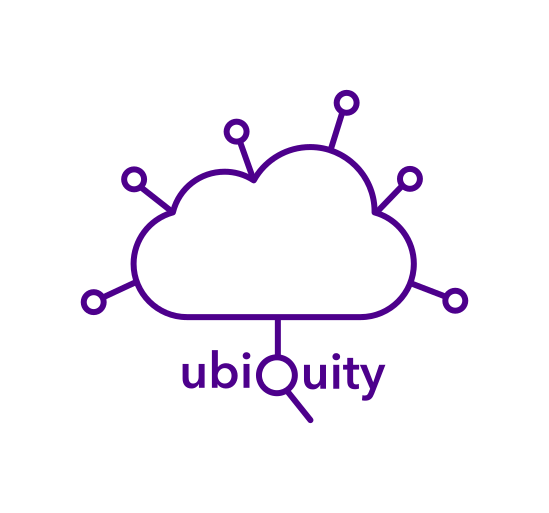

# Ubiquity

**[Features](#features) • [Get Started](#get-started) • [Documentation](https://www.uki.logicalis.com/data-HPC-Ubiquity)**

 Licensed under the Apache-2.0 Licence, post [FSL](https://fsl.software)

This project utilises [Infrastructure as Code](https://en.wikipedia.org/wiki/Infrastructure_as_code) and [GitOps](https://www.weave.works/technologies/gitops) to automate provisioning, operating, and updating self-hosted services in this environment.

It is a highly customisable framework to build HPC environments.

> **What is a HPC Cluster?**
>
> A HPC Cluster is an environment where you can leverage highly-performant nodes in potentially large numbers to solve complex problems that require high amounts of computational power to do.
> It is different from a High Throughput Computing (HTC) environment, where you have a large number of nodes that are not necessarily high-performant, but can be used to run many jobs.
> However - The two are not mutually exclusive, and you can have a HPC Cluster that also does HTC.
> For more information about HPC in general, see the [r/hpc introduction](https://www.reddit.com/r/hpc/wiki/introduction).

## Overview

Project status: **STABLE**

This project is in a stable stage now, however is still undergoing active development (and it should or it will become stale!).
Expect minor changes that may require partial redeployment (but will be managed in a non-intrusive way) - These will be noted in release notes.

All changes will be documented in the [changelog](CHANGELOG.md).

More information can be found in [the roadmap](docs/developers/roadmap.md) below.

### Hardware

The original development hardware used initially to prove low resource requirements was:

- 3 × Lenovo `ThinkCentre M700 Tiny`:
    - CPU: `Intel Core i5-6600T @ 2.70GHz`
    - RAM: `16GB`
    - SSD: `500GB`
- Netgear `GS305E` switch:
    - Ports: `5`
    - Speed: `1000Mbps`

And for sandbox mode or to act as a bootstrapper:

- 1x Lenovo `ThinkPad P16s G1`:
    - CPU: `Intel Core i7-12890T @ 3.4GHz`
    - RAM: `32GB`
    - SSD: `1TB`

Yes, it runs on tiny hardware!

### Features

- [x] Common applications: Gitea, Slurm, Harbor...
- [x] Automated bare metal provisioning with PXE boot
- [x] Baremetal-operator leveraging OpenStack Ironic to deploy and manage worker nodes
- [x] Automated Kubernetes installation and management
- [x] Installing and managing applications using GitOps
- [x] Automatic rolling upgrade for OS and Kubernetes (optional)
- [x] Automatically update apps (with approval)
- [x] Modular architecture, easy to add or remove features/components
- [x] Automated certificate management
- [x] Automatically update DNS records for exposed services
- [x] Expose services to the internet securely with [Cloudflare Tunnel](https://www.cloudflare.com/products/tunnel/)
- [x] CI/CD platform
- [x] Private container registry
- [x] Distributed storage
- [x] Support multiple environments (dev, prod, sandbox)
- [x] Support multiple platforms (on-prem, cloud)
- [x] Support multiple providers (AWS, Azure, GCP, OpenStack, OVH, bare metal)
- [x] Support multiple identity providers (Keycloak, LDAP, SAML, OIDC)
- [x] Support multiple storage providers (Ceph, NFS, GlusterFS, Longhorn, Lustre, BeeGFS, OpenEBS, Storage Scale, S3, MinIO, ZFS)
- [x] Support multiple monitoring and logging providers (Prometheus, Grafana, Loki, Alertmanager)
- [x] Support multiple ingress providers (NGINX, Traefik, HAProxy, Contour)
- [x] Support multiple DNS providers (Cloudflare, Route53, BIND)
- [x] Support multiple secret providers (Vault, Sealed Secrets)
- [x] Support multiple chat providers (Matrix, Rocket.Chat, Mattermost)
- [x] Support multiple SSO providers (Keycloak, Dex)
- [x] Support multiple workload managers (Slurm, OpenPBS, OAR, HTCondor, Kubernetes)
- [x] Monitoring and alerting
- [x] Automated offsite backups
- [ ] Single sign-on 🚧

Some demo videos and screenshots are shown here (click to enlarge).
They can't capture all the project's features, but they are sufficient to get a concept of it.

| [![][screenshot-01]][screenshot-01]                     | [![][screenshot-02]][screenshot-02]  |
| :--:                                                                                        | :--:                                                                |
| Deploy with a single command (after updating the configuration files)                       | Distributed Resilient Storage (longhorn or rook-ceph) - Longhorn shown               |
| [![][screenshot-03]][screenshot-03]                                                         | [![][screenshot-04]][screenshot-04]                                 |
| Homepage with Ingress discovery powered by [Hajimari](https://github.com/toboshii/hajimari) | Monitoring dashboard powered by [Grafana](https://grafana.com/)     |
| [![][screenshot-05]][screenshot-05]                                                         | [![][screenshot-06]][screenshot-06]                                 |
| Git server powered by [Gitea](https://gitea.io/en-us/)                                      | [AWX](https://github.com/ansible/awx/) Ansible AWX server           |
| [![][screenshot-07]][screenshot-07]                                                         | [![][screenshot-08]][screenshot-08]                                 |
| Self-Serve HPC/AI/Data/Learning environments with [Onyxia](https://www.onyxia.sh/)          | Continuous deployment with [ArgoCD](https://argoproj.github.io/cd/) |
| [![][screenshot-09]][screenshot-09]                                                         | [![][screenshot-10]][screenshot-10]                                 |
| Cluster management using [K9s](https://k9scli.io/)                                          | Federated Auth and 2FA with [Keycloak](https://www.keycloak.org/)   |
| [![][screenshot-11]][screenshot-11]                                                         | [![][screenshot-12]][screenshot-12]                                 |
| Bare metal management using the [Bare Metal Operator](https://metal3.io/)                                          | Secrets management with [Vault](https://www.vaultproject.io/)       |
| [![][screenshot-13]][screenshot-13]                                                         | [![][screenshot-14]][screenshot-14]                                 |
| Dynamically scalable [Slurm](https://slurm.schedmd.com/) environment controlled by Kubernetes       | Remote cluster administration tooling via [Opus](https://github.com/logicalisuki/ubiq_opus)       |

[screenshot-01]: docs/assets/screenshot-01.jpg
[screenshot-02]: docs/assets/screenshot-02.jpg
[screenshot-03]: docs/assets/screenshot-03.jpg
[screenshot-04]: docs/assets/screenshot-04.jpg
[screenshot-05]: docs/assets/screenshot-05.jpg
[screenshot-06]: docs/assets/screenshot-06.jpg
[screenshot-07]: docs/assets/screenshot-07.jpg
[screenshot-08]: docs/assets/screenshot-08.jpg
[screenshot-09]: docs/assets/screenshot-09.jpg
[screenshot-10]: docs/assets/screenshot-10.jpg
[screenshot-11]: docs/assets/screenshot-11.jpg
[screenshot-12]: docs/assets/screenshot-12.jpg
[screenshot-13]: docs/assets/screenshot-13.jpg
[screenshot-14]: docs/assets/screenshot-14.jpg

### Tech stack

<table>
    <tr>
        <th>Logo</th>
        <th>Name</th>
        <th>Description</th>
    </tr>
    <tr>
        <td></td>
        <td><a href="https://www.ansible.com">Ansible</a></td>
        <td>Automate bare metal provisioning and configuration</td>
    </tr>
    <tr>
        <td></td>
        <td><a href="https://argoproj.github.io/cd">ArgoCD</a></td>
        <td>GitOps tool built to deploy applications to Kubernetes</td>
    </tr>
    <tr>
        <td></td>
        <td><a href="https://cert-manager.io">cert-manager</a></td>
        <td>Cloud native certificate management</td>
    </tr>
    <tr>
        <td></td>
        <td><a href="https://www.cloudflare.com">Cloudflare</a></td>
        <td>DNS and Tunnel</td>
    </tr>
    <tr>
        <td></td>
        <td><a href="https://www.docker.com">Docker</a></td>
        <td>Ephermeral PXE server and convenient tools container</td>
    </tr>
    <tr>
        <td></td>
        <td><a href="https://github.com/kubernetes-sigs/external-dns">ExternalDNS</a></td>
        <td>Synchronizes exposed Kubernetes Services and Ingresses with DNS providers</td>
    </tr>
    <tr>
        <td></td>
        <td><a href="https://getfedora.org/en/server">Fedora Server</a></td>
        <td>Base OS for Kubernetes nodes</td>
    </tr>
    <tr>
        <td></td>
        <td><a href="https://rockylinux.org/download">RockyLinux</a></td>
        <td>Base OS for Kubernetes nodes</td>
    </tr>
    <tr>
        <td></td>
        <td><a href="https://ubuntu.com/download/server">Ubuntu</a></td>
        <td>Base OS for Kubernetes nodes</td>
    </tr>
    <tr>
        <td></td>
        <td><a href="https://gitea.com">Gitea</a></td>
        <td>Self-hosted Git service</td>
    </tr>
    <tr>
        <td></td>
        <td><a href="https://grafana.com">Grafana</a></td>
        <td>Operational dashboards</td>
    </tr>
    <tr>
        <td></td>
        <td><a href="https://helm.sh">Helm</a></td>
        <td>The package manager for Kubernetes</td>
    </tr>
    <tr>
        <td></td>
        <td><a href="https://k3s.io">K3s</a></td>
        <td>Lightweight distribution of Kubernetes</td>
    </tr>
    <tr>
        <td></td>
        <td><a href="https://kubernetes.io">Kubernetes</a></td>
        <td>Container-orchestration system, the backbone of this project</td>
    </tr>
    <tr>
        <td></td>
        <td><a href="https://grafana.com/oss/loki">Loki</a></td>
        <td>Log aggregation system</td>
    </tr>
    <tr>
        <td></td>
        <td><a href="https://longhorn.io">Longhorn</a></td>
        <td>Cloud native distributed block storage for Kubernetes</td>
    </tr>
    <tr>
        <td></td>
        <td><a href="https://metallb.org">MetalLB</a></td>
        <td>Bare metal load-balancer for Kubernetes</td>
    </tr>
    <tr>
        <td></td>
        <td><a href="https://www.nginx.com">NGINX</a></td>
        <td>Kubernetes Ingress Controller</td>
    </tr>
    <tr>
        <td></td>
        <td><a href="https://prometheus.io">Prometheus</a></td>
        <td>Systems monitoring and alerting toolkit</td>
    </tr>
    <tr>
        <td></td>
        <td><a href="https://www.whitesourcesoftware.com/free-developer-tools/renovate">Renovate</a></td>
        <td>Automatically update dependencies</td>
    </tr>
    <tr>
        <td></td>
        <td><a href="https://trow.io">Trow</a></td>
        <td>Private container registry</td>
    </tr>
    <tr>
        <td></td>
        <td><a href="https://www.vaultproject.io">Vault</a></td>
        <td>Secrets and encryption management system</td>
    </tr>
</table>

## Get Started

- [Try it out locally](docs/admin-guide/deployment/sandbox.md) without any hardware (just 4 commands!)
- [Deploy on real hardware](docs/admin-guide/deployment/on-prem.md) for production workloads

## Roadmap

See [roadmap](docs/reference/roadmap.md) and [open issues](https://github.com/logicalisuki/ubiquity-open/issues) for a list of proposed features and known issues.

## Contributing

Any contributions you make are greatly appreciated.

Please see [contributing guide](CONTRIBUTING.md) for more information.

## License

Copyright &copy; 2023 - Logicalis UKI

Distributed under the Apache-2.0 License. Previously released under the Functional Source License, Version 1.0, Apache 2.0 Change (FSL-1.0-Apache-2.0) License.
See [license page](LICENSE) for more information.

## Acknowledgements

References:

- [ArgoCD usage and monitoring configuration in locmai/humble](https://github.com/locmai/humble)
- [README template](https://github.com/othneildrew/Best-README-Template)
- [Run the same Cloudflare Tunnel across many `cloudflared` processes](https://developers.cloudflare.com/cloudflare-one/tutorials/many-cfd-one-tunnel)
- [MAC address environment variable in GRUB config](https://askubuntu.com/questions/1272400/how-do-i-automate-network-installation-of-many-ubuntu-18-04-systems-with-efi-and)
- [Official k3s systemd service file](https://github.com/k3s-io/k3s/blob/master/k3s.service)
- [Official Cloudflare Tunnel examples](https://github.com/cloudflare/argo-tunnel-examples)
- [Initialize GitOps repository on Gitea and integrate with Tekton by RedHat](https://github.com/redhat-scholars/tekton-tutorial/tree/master/triggers)
- [SSO configuration from xUnholy/k8s-gitops](https://github.com/xUnholy/k8s-gitops)
- [Pre-commit config from k8s-at-home/flux-cluster-template](https://github.com/k8s-at-home/flux-cluster-template)
- [Kubernetes cluster monitoring with Prometheus and Grafana](https://devopscube.com/setup-prometheus-monitoring-on-kubernetes/)
- [Bare metal provisioning with Ironic](https://docs.openstack.org/ironic/latest/install/configure-pxe.html)
- [Metal3 bare metal operator](https://github.com/metal3-io/baremetal-operator)
- [Cloudflare Tunnel with Kubernetes](https://developers.cloudflare.com/cloudflare-one/tutorials/many-cfd-one-tunnel)
- [AWS ParallelCluster](https://github.com/aws/aws-parallelcluster)
- [OpenHPC](https://openhpc.community/)
- [NVIDIA HPC SDK](https://docs.nvidia.com/hpc-sdk/index.html)
- [NVIDIA HPC SDK container images](https://docs.nvidia.com/hpc-sdk/containers/index.html)
- [NVIDIA DeepOps](https://github.com/NVIDIA/deepops)

Here is a list of the contributors/supporters who have helped to improve this project. A big shout-out to them, of which without their support this project would not be possible.

-  [@CJCShadowsan](https://github.com/CJCShadowsan)
-  [@bathomas](https://github.com/bathomas)
-  [@owainkenwayucl](https://github.com/owainkenwayucl)
-  [@ds-04](https://github.com/ds-04)
-  [@tomgreen66](https://github.com/tomgreen66)
-  [@scottrhodges](https://github.com/scottrhodges)
-  [Vanessa Sochat](https://github.com/vsoch)
  
If you feel you're missing from this list, feel free to add yourself in a PR.
