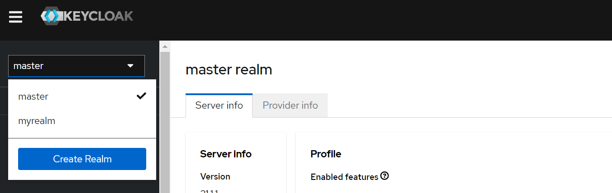
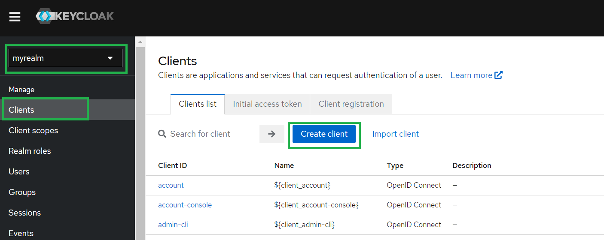
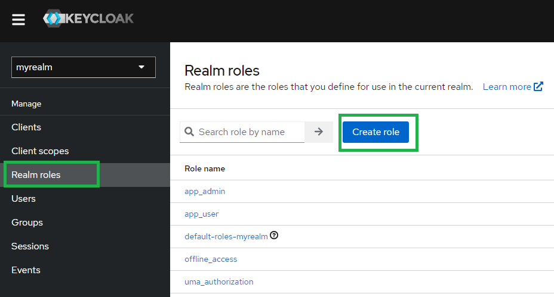
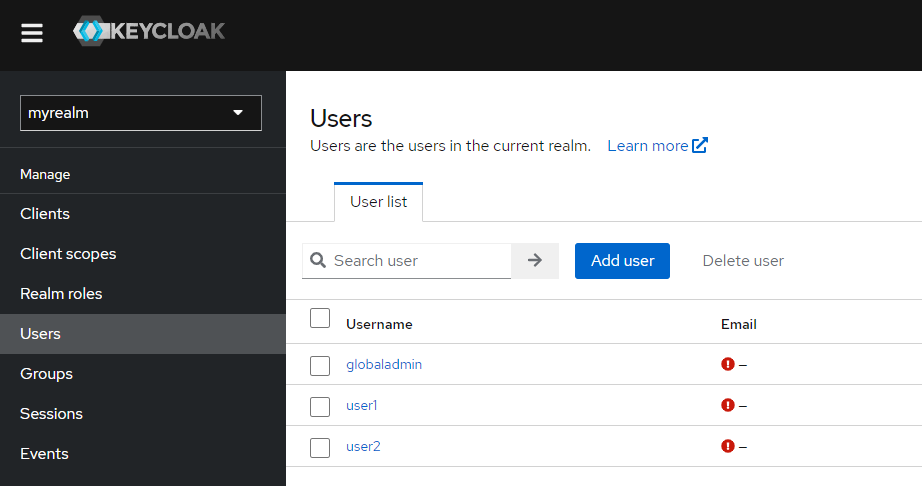
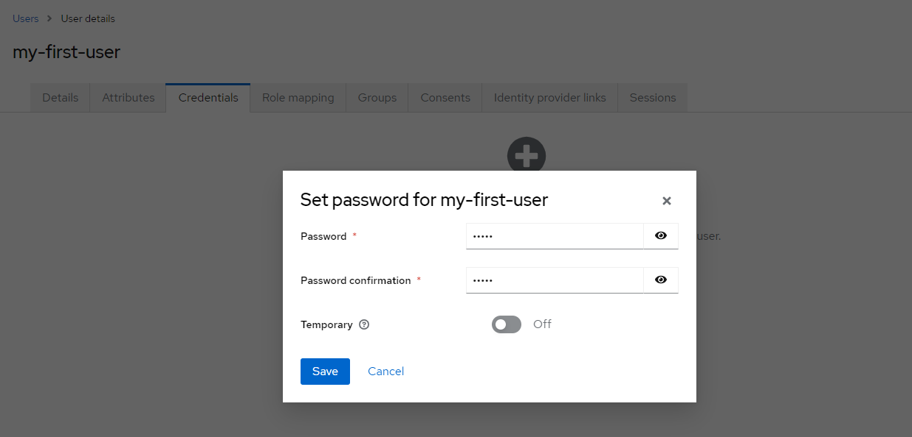

# Keycloak – Create Realm, Client, Roles, and User
Keycloak is Open Source Identity and Access Management (IAM) tool developed by Red Hat. By using this you can add authentication to applications and secure services with minimum effort. No need to deal with storing users or authenticating users. Keycloak provides user federation, strong authentication, user management, fine-grained authorization, and more.

Note: Keycloak is already installed on your machine. It is present at `https://keycloak.<cluster-domain>/` URL.

In this guide, we will see how to Create a Realm, Client, and User in Keycloak.

## Creating Realm in Keycloak
Realm is a management entity that controls a set of users, their credentials, roles, and groups. A user belongs to and logs into a realm. In the context of Keycloak, a realm refers to a security and administrative domain where users, applications, and roles are managed. It is a fundamental concept in Keycloak’s architecture that allows you to isolate and organize resources, permissions, and configurations. Now let’s see how to create a Realm in Keycloak.

Step 1: Go to the Master drop-down menu, and click on the Create Realm button.

Step 2: Then provide your realm name and clock on the Create button and you are done with creating Realm in Keycloak. Remember that avoid using the master realm and create your own realm.

## Creating Client in Keycloak
In Keycloak, a client refers to an application or service that interacts with the Keycloak server for authentication and authorization purposes. It can be a web application, a mobile app, a server-side API, or any other type of application that needs to authenticate and authorize its users. Now let’s see how to create a Client in Keycloak.

Step 1: To create a new client, click on the Clients menu from the left pane and click the Create Client button. Make sure you have chosen your realm instead of the Master realm.

Step 2: Then you will be prompted for a Client type, a Client ID, and other basic info. Keep the client type as same as OpenID Connect. You can give a name and description to the client as per your choice.

After clicking Next in the Capability config keep the default config. Then click next. In the Login settings, you have to provide the Valid Redirect URIs field. Here you have to provide the port in which your application is running.

Note: Please don’t provide 8080 as your Keycloak is running on this port.

And you are done with creating a Client in Keycloak.

## Creating Roles in Keycloak
In Keycloak, roles are used to define and manage permissions and access levels for users and clients within a realm. Roles provide a way to control and enforce authorization policies, allowing you to specify what users or clients are allowed to do within your system. There are two main types of roles in Keycloak:

- Realm Roles: These roles are defined at the realm level and are available across all clients within that realm. Realm roles are typically used for global permissions that apply to all applications within the realm. For example, you can create roles like “admin,” “user,” or “manager” at the realm level.
- Client Roles: These roles are specific to individual client applications within the realm. Each client can have its own set of roles that define access permissions specific to that application. For example, for a social media application, you might have roles like “post,” “comment,” or “like” at the client level.

## Creating Realm Roles
Step 1: To create a new Realm Roles, click on the Realm roles menu from the left pane and click the Create role button.

Step 2: In the next screen provide the role name as per your requirements.

## Creating Client Roles
Step 1: To create a new Client Role, navigate to clients from the left panel. Then select your client created by you. Then click Roles Press the Create role button.

Step 2: In the next screen provide the role name as per your requirements.

## Creating a User in Keycloak
In Keycloak, a user represents an individual entity that can authenticate and interact with the Keycloak server. Users can be individuals who need to access applications or services secured by Keycloak or administrators who manage the Keycloak realm and its configurations.

Step 1: In the Users page, click on Add user button.

Step 2: On the next page provide the required details of a User and click on Create button.

Step 3: Now we need to set a password for the user. Click the Credentials tab and press the Set password button.

Step 4: Now we need to set a role for the user. Click the Role mapping tab and press Assign role.

Now the Realm roles list will be available in the table. Check the required role and click Assign to map it to the respective user.

And you are done with creating a User.

Whether you're preparing for your first job interview or aiming to upskill in this ever-evolving tech landscape, GeeksforGeeks Courses are your key to success. We provide top-quality content at affordable prices, all geared towards accelerating your growth in a time-bound manner. Join the millions we've already empowered, and we're here to do the same for you. Don't miss out - check it out now!