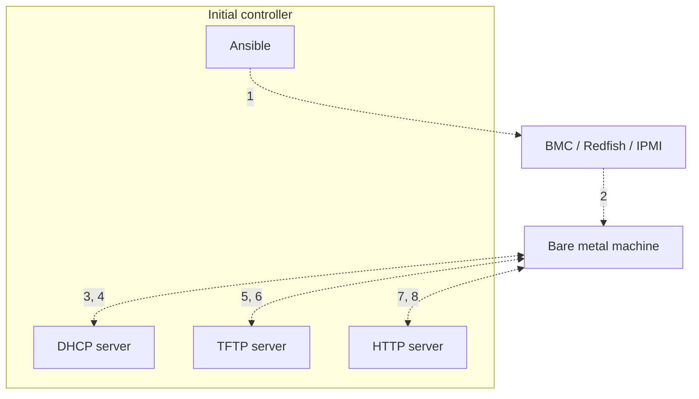

# PXE boot

PXE boot lets a controller start a bare-metal machine over the network, deliver a
bootloader, and install an operating system without attaching local installation
media.

1. Ansible or NICo asks the BMC to power on or reboot the target machine.
2. The BMC starts the machine with network boot enabled.
3. The machine broadcasts a DHCP request that includes its MAC address and PXE
   capabilities.
4. DHCP assigns an address and points the machine at the bootloader endpoint.
5. The machine requests the bootloader from TFTP or the configured network boot
   service.
6. The boot service returns the bootloader, kernel, and initial ramdisk details.
7. The booted installer requests kickstart, cloud-init, packages, or image data
   from HTTP.
8. The machine installs the OS and reboots into the installed system.

## What to validate

Before using PXE for production machines, validate these items in a lab or
virtual bare-metal environment:

- BMC/Redfish/IPMI credentials are stored in Vault or another approved secret
  store, not in Git.
- DHCP serves the expected MAC address and does not overlap with another
  production DHCP authority.
- TFTP or network boot endpoints serve the expected bootloader and kernel.
- HTTP install endpoints serve the intended OS image and configuration.
- OS image provenance, checksum, architecture, and boot mode are recorded.
- NICo or the selected lifecycle controller reports the machine status after the
  install.

This page explains the PXE flow. It is not a live hardware proof by itself. Live
production readiness requires controller status, BMC reachability, successful PXE
boot, OS install evidence, and post-install node health from the target cluster.

## Troubleshooting

- No DHCP lease: confirm the target MAC address, VLAN, switch port, and DHCP
  scope.
- Bootloader not found: confirm the next-server/filename options and that the
  boot endpoint is reachable from the provisioning network.
- Installer starts but cannot fetch configuration: check HTTP routing, firewall
  rules, and the generated install URL.
- Machine installs the wrong image: verify inventory image mapping and checksum
  metadata before rebooting the node.
- Controller says ready but node is absent from Kubernetes: inspect NICo status,
  kubelet logs, and node join token configuration.
