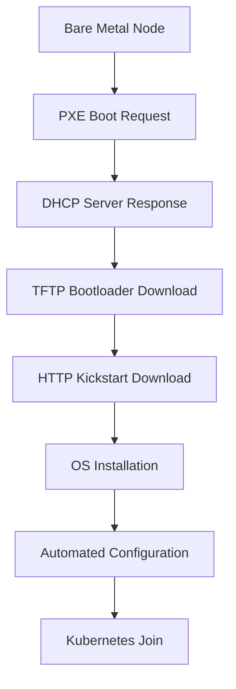

# Operating System Images for Ubiquity

## On This Page

- [Overview](#overview)
- [Scope](#scope)
- [Prerequisites](#prerequisites)
- [Ubiquity Image Building](#ubiquity-image-building)
- [Custom Image Creation](#custom-image-creation)
- [Bare Metal Deployment](#bare-metal-deployment)
- [Cloud Deployment](#cloud-deployment)
- [Advanced Configurations](#advanced-configurations)
- [Troubleshooting](#troubleshooting)

## Overview

This guide provides comprehensive instructions for creating, customizing, and deploying operating system images within the Ubiquity platform. Ubiquity supports multiple deployment scenarios including bare metal provisioning, cloud deployments, and hybrid environments, each with specific image requirements and customization options.

## Scope

This guide covers:
- **Base OS Images**: Rocky Linux, Ubuntu, and Fedora support for Ubiquity clusters
- **Bare Metal Images**: PXE-bootable images for automated provisioning
- **Cloud Images**: Custom images for cloud providers (AWS, Azure, GCP, OpenStack)
- **Container Images**: Base images for HPC workloads and applications
- **Specialized Images**: HPC-optimized images with NVIDIA drivers, InfiniBand support, and performance tools

## Prerequisites

### Hardware Requirements
- **Build Host**: System capable of running diskimage-builder (minimum 4GB RAM, 20GB storage)
- **Target Platform**: Bare metal servers or cloud instances for deployment

### Software Requirements
- **Operating System**: Rocky Linux 8/9, Ubuntu 20.04/22.04, or Fedora Server
- **Tools**: diskimage-builder, qemu-utils, ansible (for bare metal)
- **Access**: Administrative privileges on build host

### Abbreviations and Acronyms
- **BMO**: Bare Metal Operator
- **DIB**: Disk Image Builder  
- **HPC**: High Performance Computing
- **IPA**: Ironic Python Agent
- **MLNX_OFED**: NVIDIA Mellanox OpenFabrics Enterprise Distribution
- **PXE**: Preboot Execution Environment

## Ubiquity Image Building

### Built-in Image Builder

Ubiquity includes a comprehensive image building system located in `tools/disk-image/mkimage/` that provides:

- **Automated Building**: Script-based image creation with minimal configuration
- **Multiple Formats**: Support for qcow2, raw, and other disk formats
- **Custom Elements**: Pre-built elements for Ubiquity-specific configurations
- **Multi-Architecture**: Support for x86_64 and ARM64 architectures

### Supported Operating Systems

**Rocky Linux (Recommended)**
- Rocky Linux 8.x and 9.x
- Default choice for Ubiquity deployments
- Optimized kickstart configurations for bare metal
- Full HPC stack support

**Ubuntu Server**
- Ubuntu 20.04 LTS and 22.04 LTS
- Cloud-optimized images
- Extensive package ecosystem

**Fedora Server**
- Latest stable releases
- Cutting-edge kernel features
- Development and testing environments

### Quick Start

```bash
# Navigate to image builder
cd tools/disk-image/mkimage

# Prepare build environment
./prep.sh

# Build all images
./build-images.sh

# Build specific images
image_filter="rocky" ./build-images.sh

# Specify output format
output_type="qcow2,raw" ./build-images.sh
```

### Available Custom Elements

**Ubiquity Element** (`custom-elements/ubiquity/`)
- Core Ubiquity platform integration
- Kubernetes node preparation
- Longhorn storage optimization

**MOFED Element** (`custom-elements/mofed/`)
- NVIDIA MLNX_OFED network drivers
- InfiniBand support for HPC workloads
- High-speed interconnect optimization

**Cloud-init Element** (`custom-elements/cloud-init-install/`)
- Cloud environment compatibility
- Automated system configuration
- User and SSH key management

**Custom Base Element** (`custom-elements/custom-base/`)
- Common configurations across all images
- Package installations and system tuning
- Security hardening

## Custom Image Creation

### Setting Up Build Environment

**Rocky Linux Build Host:**
```bash
# Install dependencies
sudo dnf install -y qemu-img python3-pip git
sudo pip3 install diskimage-builder

# Clone Ubiquity repository
git clone https://github.com/ubiquitycluster/ubiquity.git
cd ubiquity-open/tools/disk-image/mkimage

# Initialize build environment
./prep.sh
```

**Ubuntu Build Host:**
```bash
# Install dependencies
sudo apt update
sudo apt install -y qemu-utils python3-pip git
sudo pip3 install diskimage-builder

# Setup Ubiquity build environment
git clone https://github.com/ubiquitycluster/ubiquity.git
cd ubiquity-open/tools/disk-image/mkimage
./prep.sh
```

### Creating Ubiquity-Optimized Images

**Basic Ubiquity Node Image:**
```bash
export ELEMENTS_PATH="custom-elements:elements"
export DIB_RELEASE="9"  # Rocky 9

disk-image-create \
  vm \
  dhcp-all-interfaces \
  cloud-init-datasources \
  dracut-regenerate \
  growroot \
  rocky-container \
  ubiquity \
  cloud-init-install \
  -o ubiquity-node-rocky9
```

**HPC-Optimized Image with InfiniBand:**
```bash
export ELEMENTS_PATH="custom-elements:elements"
export DIB_RELEASE="9"
export DIB_MOFED_FILE="/tmp/MLNX_OFED_LINUX-5.8-1.0.1.1-rhel8.7-x86_64.iso"

disk-image-create \
  vm \
  dhcp-all-interfaces \
  cloud-init-datasources \
  dracut-regenerate \
  growroot \
  rocky-container \
  ubiquity \
  mofed \
  cloud-init-install \
  -o ubiquity-hpc-rocky9
```

**GPU-Enabled Compute Image:**
```bash
export ELEMENTS_PATH="custom-elements:elements"
export DIB_RELEASE="9"
export DIB_CUDA_URL="https://developer.download.nvidia.com/compute/cuda/12.2.0/local_installers/cuda_12.2.0_535.54.03_linux.run"

disk-image-create \
  vm \
  dhcp-all-interfaces \
  cloud-init-datasources \
  dracut-regenerate \
  growroot \
  rocky-container \
  ubiquity \
  nvidia-cuda \
  cloud-init-install \
  -o ubiquity-gpu-rocky9
```

## Bare Metal Deployment

### Kickstart-Based Provisioning

Ubiquity's bare metal deployment uses automated kickstart installations optimized for HPC environments:

**Key Features:**
- **Automated Partitioning**: Intelligent disk layout based on available storage
- **LVM Configuration**: Optimized for Kubernetes and Longhorn storage
- **Network Configuration**: Support for bonding, VLANs, and complex topologies
- **Security**: Automated SSH key deployment and system hardening

**Partition Layout (Rocky Linux):**
```bash
# System Volume Group (Smallest disk)
/boot/efi     512MB   vfat
/boot         2GB     ext4
/             20%     ext4  (System VG)
/tmp          5%      ext4  (System VG)
/var/log      2%      ext4  (System VG)
/var/crash    10%     ext4  (System VG)
/var/lib/rancher 10%  ext4  (System VG)
/home         53%     ext4  (System VG)

# Data Volume Group (Larger disks)
/var/lib/kubelet    1%   ext4  (Data VG)
/var/lib/longhorn   60%  ext4  (Data VG)
/home              39%   ext4  (Data VG)
```

**Network Configuration Examples:**

*Single Interface:*
```yaml
network_interfaces:
  - name: eno1
    device: eno1
    ip: 192.168.1.100
    netmask: 255.255.255.0
    gateway: 192.168.1.1
    nameserver: 192.168.1.1
```

*Bonded Interface:*
```yaml
network_interfaces:
  - name: bond0
    device: bond0
    slaves: eno1,eno2
    bond_opts: "mode=802.3ad miimon=100"
    ip: 192.168.1.100
    netmask: 255.255.255.0
    gateway: 192.168.1.1
```

*VLAN Configuration:*
```yaml
network_interfaces:
  - name: vlan100
    device: eno1
    vlanid: 100
    ip: 10.0.100.100
    netmask: 255.255.255.0
```

### PXE Boot Process

Ubiquity implements a comprehensive PXE boot system for bare metal provisioning:



**DHCP Configuration:**
```bash
# Node receives IP, boot server, and bootloader info
subnet 192.168.1.0 netmask 255.255.255.0 {
    range 192.168.1.100 192.168.1.200;
    option domain-name-servers 192.168.1.1;
    option domain-name "ubiquitycluster.local";
    option routers 192.168.1.1;
    filename "pxelinux.0";
    next-server 192.168.1.10;
}
```

**Boot Configuration:**
```bash
# PXE menu entry for Rocky Linux installation
LABEL rocky9-install
    MENU LABEL Install Rocky Linux 9 (Ubiquity)
    KERNEL vmlinuz-rocky9
    APPEND initrd=initrd-rocky9.img ks=http://192.168.1.10/kickstart/node01.ks
```

## Cloud Deployment

### Cloud Provider Images

**AWS AMI Creation:**
```bash
# Create AMI-compatible image
export AWS_DEFAULT_REGION="us-west-2"
export DIB_RELEASE="9"

disk-image-create \
  vm \
  cloud-init-datasources \
  growroot \
  install-static \
  rocky-container \
  ubiquity \
  -t ami \
  -o ubiquity-aws-rocky9
```

**Azure VHD Creation:**
```bash
# Create Azure-compatible VHD
export DIB_RELEASE="9"

disk-image-create \
  vm \
  azure \
  cloud-init-datasources \
  growroot \
  rocky-container \
  ubiquity \
  -t vhd \
  -o ubiquity-azure-rocky9
```

**GCP Image Creation:**
```bash
# Create GCP-compatible image
export DIB_RELEASE="9"

disk-image-create \
  vm \
  google \
  cloud-init-datasources \
  growroot \
  rocky-container \
  ubiquity \
  -o ubiquity-gcp-rocky9
```

**OpenStack Image Creation:**
```bash
# Create OpenStack-compatible qcow2 image
export DIB_RELEASE="9"

disk-image-create \
  vm \
  dhcp-all-interfaces \
  cloud-init-datasources \
  growroot \
  rocky-container \
  ubiquity \
  -o ubiquity-openstack-rocky9

# Upload to OpenStack
openstack image create \
  --public \
  --disk-format qcow2 \
  --container-format bare \
  --file ubiquity-openstack-rocky9.qcow2 \
  "Ubiquity Rocky 9"
```

### Cloud-init Configuration

Ubiquity images include comprehensive cloud-init support:

**User Configuration:**
```yaml
#cloud-config
users:
  - name: admin
    groups: wheel
    shell: /bin/bash
    sudo: ['ALL=(ALL) NOPASSWD:ALL']
    ssh-authorized-keys:
      - ssh-rsa AAAAB3NzaC1yc2E... admin@ubiquity
```

**Package Installation:**
```yaml
packages:
  - kubectl
  - docker
  - git
  - htop
  - iotop
  - nfs-utils
```

**Service Configuration:**
```yaml
runcmd:
  - systemctl enable --now docker
  - systemctl enable --now kubelet
  -  /opt/ubiquity/setup-node.sh
```

## Advanced Configurations

### HPC-Optimized Images

**InfiniBand and RDMA Support:**
```bash
# Enable RDMA networking for HPC workloads
export DIB_RELEASE="9"
export DIB_MOFED_FILE="/path/to/MLNX_OFED_LINUX-5.8-1.0.1.1-rhel9.0-x86_64.iso"

disk-image-create \
  vm \
  dhcp-all-interfaces \
  cloud-init-datasources \
  dracut-regenerate \
  growroot \
  rocky-container \
  ubiquity \
  mofed \
  cloud-init-install \
  -o ubiquity-hpc-ib-rocky9
```

**Multi-GPU Configurations:**
```bash
# Support for multiple GPU configurations
export DIB_RELEASE="9"
export DIB_CUDA_URL="https://developer.download.nvidia.com/compute/cuda/12.2.0/local_installers/cuda_12.2.0_535.54.03_linux.run"
export DIB_GPU_DRIVER_VERSION="535.54.03"

disk-image-create \
  vm \
  dhcp-all-interfaces \
  cloud-init-datasources \
  dracut-regenerate \
  growroot \
  rocky-container \
  ubiquity \
  nvidia-cuda \
  nvidia-fabric-manager \
  cloud-init-install \
  -o ubiquity-multi-gpu-rocky9
```

**Container Runtime Integration:**
```bash
# Docker and containerd optimizations for HPC
export DIB_RELEASE="9"
export DIB_CONTAINER_RUNTIME="containerd"
export DIB_DOCKER_STORAGE_DRIVER="overlay2"

disk-image-create \
  vm \
  dhcp-all-interfaces \
  cloud-init-datasources \
  dracut-regenerate \
  growroot \
  rocky-container \
  ubiquity \
  container-runtime \
  nvidia-container-toolkit \
  cloud-init-install \
  -o ubiquity-container-rocky9
```

### Storage Optimizations

**Longhorn Storage Preparation:**
```bash
# Optimized for Longhorn distributed storage
export DIB_RELEASE="9"
export DIB_LONGHORN_VERSION="1.5.1"

disk-image-create \
  vm \
  dhcp-all-interfaces \
  cloud-init-datasources \
  dracut-regenerate \
  growroot \
  rocky-container \
  ubiquity \
  longhorn-prep \
  cloud-init-install \
  -o ubiquity-storage-rocky9
   

```

**NFS and Distributed Storage:**
```bash
# Support for NFS and distributed filesystems
export DIB_RELEASE="9"

disk-image-create \
  vm \
  dhcp-all-interfaces \
  cloud-init-datasources \
  dracut-regenerate \
  growroot \
  rocky-container \
  ubiquity \
  nfs-client \
  cvmfs-client \
  cloud-init-install \
  -o ubiquity-nfs-rocky9
```

### Networking Configurations

**SR-IOV and Hardware Acceleration:**
```bash
# Support for SR-IOV and hardware offloading
export DIB_RELEASE="9"
export DIB_SRIOV_DRIVERS="i40e,ixgbe,mlx5_core"

disk-image-create \
  vm \
  dhcp-all-interfaces \
  cloud-init-datasources \
  dracut-regenerate \
  growroot \
  rocky-container \
  ubiquity \
  sriov-support \
  dpdk-support \
  cloud-init-install \
  -o ubiquity-sriov-rocky9
```

**Advanced Security Features:**
```bash
# Security hardening and compliance
export DIB_RELEASE="9"
export DIB_SECURITY_PROFILE="hardened"

disk-image-create \
  vm \
  dhcp-all-interfaces \
  cloud-init-datasources \
  dracut-regenerate \
  growroot \
  rocky-container \
  ubiquity \
  security-hardening \
  audit-logging \
  cloud-init-install \
  -o ubiquity-secure-rocky9
```

### Performance Tuning

**Kernel and System Optimizations:**
```yaml
# Custom kernel parameters for HPC workloads
kernel_parameters:
  - "intel_iommu=on"
  - "iommu=pt"
  - "hugepagesz=1G"
  - "hugepages=32"
  - "default_hugepagesz=1G"
  - "isolcpus=1-15,17-31"
  - "rcu_nocbs=1-15,17-31"
  - "nohz_full=1-15,17-31"
```

**CPU Tuning:**
```bash
# CPU governor and frequency scaling
echo "performance" > /sys/devices/system/cpu/cpu*/cpufreq/scaling_governor

# CPU isolation for real-time workloads
echo "1-15,17-31" > /sys/devices/system/cpu/isolated
```

**Memory Optimizations:**
```bash
# Huge page configuration
echo 1024 > /proc/sys/vm/nr_hugepages
echo "vm.nr_hugepages = 1024" >> /etc/sysctl.conf

# NUMA policy optimization
echo "interleave" > /proc/sys/kernel/numa_balancing
```

## Troubleshooting

### Build Issues

**Common Build Failures:**

*Insufficient Disk Space:*
```bash
# Check available space
df -h /tmp

# Clean up previous builds
rm -rf /tmp/image.* ~/.cache/diskimage-builder/

# Use alternative temp directory
export TMP_DIR="/var/tmp"
export DIB_IMAGE_CACHE="/var/cache/diskimage-builder"
```

*Network Connectivity Issues:*
```bash
# Verify repository access
curl -I http://mirror.centos.org/centos/

# Configure proxy if needed
export HTTP_PROXY="http://proxy.example.com:8080"
export HTTPS_PROXY="https://proxy.example.com:8080"
```

*Element Dependencies:*
```bash
# Verify custom elements path
ls -la custom-elements/

# Check element permissions
find custom-elements/ -name "*.sh" -exec chmod +x {} \;

# Debug element execution
export DIB_DEBUG_TRACE=1
```

### Deployment Issues

**PXE Boot Problems:**

*DHCP Configuration:*
```bash
# Check DHCP server status
systemctl status dhcpd

# Verify lease file
tail -f /var/lib/dhcpd/dhcpd.leases

# Test DHCP response
dhcping -s 192.168.1.10 -c 192.168.1.100
```

*TFTP Issues:*
```bash
# Verify TFTP service
systemctl status tftp

# Test TFTP connectivity
tftp 192.168.1.10 -c get pxelinux.0

# Check file permissions
ls -la /var/lib/tftpboot/
```

*Kickstart Problems:*
```bash
# Validate kickstart syntax
ksvalidator /var/www/html/kickstart/node01.ks

# Check HTTP access
curl -I http://192.168.1.10/kickstart/node01.ks

# Monitor installation logs
tail -f /var/log/httpd/access_log
```

### Performance Issues

**Image Size Optimization:**
```bash
# Remove unnecessary packages
export DIB_MINIMAL_IMAGE=1

# Clean package cache
export DIB_APT_CLEAN=1
export DIB_YUM_CLEAN=1

# Compress images
qemu-img convert -c -O qcow2 input.qcow2 output-compressed.qcow2
```

**Boot Time Optimization:**
```bash
# Reduce systemd timeout
sed -i 's/#DefaultTimeoutStartSec=90s/DefaultTimeoutStartSec=30s/' /etc/systemd/system.conf

# Disable unnecessary services
systemctl disable NetworkManager-wait-online
systemctl disable plymouth-start
```

### Monitoring and Logging

**Build Process Monitoring:**
```bash
# Monitor build progress
tail -f /tmp/dib-build-*.log

# Check system resources during build
watch -n 5 'df -h && free -h && ps aux | grep disk-image'
```

**Runtime Diagnostics:**
```bash
# Check node health
kubectl get nodes -o wide

# Monitor system metrics
top
iostat -x 1
sar -u 1 5

# Network diagnostics
ss -tuln
netstat -i
```

**Log Analysis:**
```bash
# System logs
journalctl -f -u kubelet
journalctl -f -u docker

# Kubernetes logs
kubectl logs -n kube-system -l k8s-app=kubelet

# Storage logs
kubectl logs -n longhorn-system -l app=longhorn-manager
```

### Recovery Procedures

**Failed Deployments:**
```bash
# Reset failed node
ansible-playbook -i inventories/production clean.yml --limit failed_node

# Reinstall from PXE
ipmitool -I lanplus -H <bmc_ip> -U admin -P password chassis bootdev pxe
ipmitool -I lanplus -H <bmc_ip> -U admin -P password power reset
```

**Image Corruption:**
```bash
# Verify image integrity
qemu-img check ubiquity-node-rocky9.qcow2

# Repair corrupted image
qemu-img convert -f qcow2 -O qcow2 corrupted.qcow2 repaired.qcow2

# Rebuild if necessary
rm -f corrupted.qcow2
./build-images.sh
```

**Configuration Recovery:**
```bash
# Backup configurations
cp -r custom-elements/ custom-elements.backup.$(date +%Y%m%d)

# Restore from version control
git checkout -- custom-elements/

# Reset to working configuration
git reset --hard <working_commit_hash>
```
