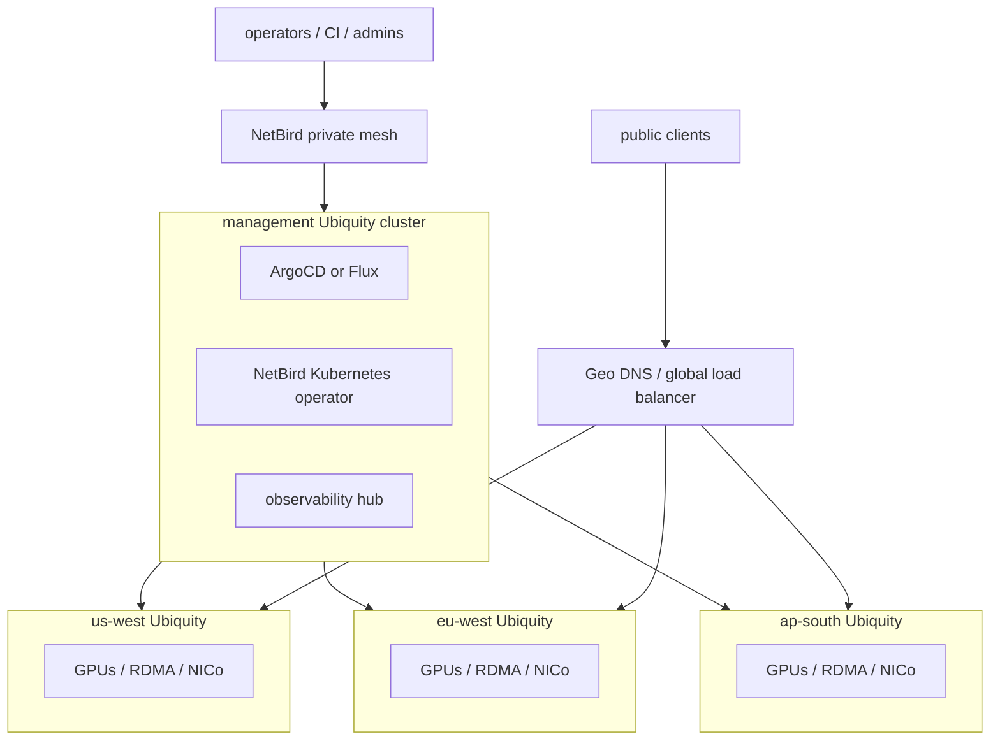

# Multi-cluster NetBird overlay

Ubiquity uses NetBird to connect many complete regional Ubiquity clusters, not to stretch one Kubernetes cluster across geographic distances. NetBird is the private control/data overlay for GitOps control, administrator access, observability, and tightly scoped private service paths between independent Ubiquity clusters.

The design rule is simple: build many autonomous Ubiquity clusters and connect them; do not stretch one Kubernetes cluster across regions.

## Target topology



The management cluster runs the fleet control plane. It can be a small highly available Ubiquity cluster or a managed Kubernetes cluster. It runs ArgoCD, the NetBird Kubernetes operator, secret integration, and central observability. It does not own latency-sensitive GPU scheduling for remote regions unless explicitly configured as a workload cluster.

Each regional cluster remains its own Ubiquity installation with its own Kubernetes API, CNI, storage, ingress, GPU Operator, NVIDIA Network Operator, and NVIDIA NIC Configuration Operator (NICo) policy. Regional clusters join the same NetBird mesh only for private management and explicitly allowed private service paths.

## Non-goals and hard boundaries

- Do not stretch one Kubernetes cluster across regions.
- Do not stretch etcd, the Kubernetes control plane, CNI, storage replication, RDMA fabrics, or NCCL collectives over arbitrary geographic NetBird/WireGuard paths.
- Do not treat NetBird reachability as service readiness.
- Do not route public inference traffic through the management cluster or hairpin through NetBird.
- Do not use one cluster's GPU, RDMA, or NICo readiness evidence for another cluster.
- Do not commit NetBird PATs, setup keys, kubeconfigs, bearer tokens, private keys, or cluster CA material.

## Management cluster responsibilities

The management cluster provides private fleet control:

1. Install ArgoCD and ApplicationSet support. ADR-007 already selects ArgoCD because ApplicationSet enables multi-cluster and multi-environment patterns.
2. Install the NetBird Kubernetes operator with its API token stored outside Git through SOPS, External Secrets, Sealed Secrets, or a cloud secret manager.
3. Expose the ArgoCD UI only as a NetBird resource for the `platform-admins` group.
4. Inject a NetBird sidecar into the ArgoCD application-controller, or provide an equivalent routing peer, so ArgoCD can reach remote Kubernetes APIs over the private mesh.
5. Register remote clusters using NetBird-reachable API endpoints.
6. Deploy fleet applications with ApplicationSet selectors, not with one global Kubernetes scheduler.
7. Aggregate observability and readiness summaries without converting object existence into readiness claims.

Conceptual control path:

```text
argocd-application-controller + NetBird sidecar
  -> NetBird private mesh
  -> https://NETBIRD_OVERLAY_IP_OR_DNS:6443 on a regional Ubiquity cluster
```

## Regional cluster responsibilities

Each regional Ubiquity cluster owns its local operational truth:

- Kubernetes API and local control plane health.
- CNI and default-deny NetworkPolicy behavior.
- Storage, restore drills, and service-specific readiness markers.
- Local ingress or Gateway API resources for tenant services.
- GPU Operator evidence, device plugin/runtime evidence, and DCGM telemetry.
- NVIDIA Network Operator, Multus `NetworkAttachmentDefinition` objects, and `nvidia.com/rdma` allocatable resources where RDMA is enabled.
- NVIDIA NIC Configuration Operator policy reconciliation, firmware storage boundaries, and NIC template safety checks.
- RDMA smoke markers and inference smoke tests before the region receives traffic.

Regional clusters expose only necessary private resources to NetBird:

- Kubernetes API for GitOps control.
- ArgoCD/observability/admin endpoints when explicitly required.
- Internal inference endpoints only for private clients or east-west flows that pass policy review.
- Storage or BMC/NICo day-2 management endpoints only through dedicated groups and ports.

## Cluster label taxonomy

Register each remote cluster in ArgoCD with explicit labels. These labels become the contract for ApplicationSet targeting and traffic eligibility.

Recommended labels:

| Label | Example | Purpose |
| --- | --- | --- |
| `ubiquity.io/region` | `us-west` | Geography and traffic routing bucket. |
| `ubiquity.io/site` | `spanish-fork` | Physical site or data center. |
| `ubiquity.io/trust-tier` | `production` | Deployment and policy boundary. |
| `ubiquity.io/gpu` | `true` | GPU-capable cluster. |
| `ubiquity.io/gpu-class` | `h100` | Scheduling/placement hint. |
| `ubiquity.io/rdma` | `true` | RDMA evidence required before RDMA workloads. |
| `ubiquity.io/inference` | `true` | Eligible for inference stack deployment. |
| `ubiquity.io/storage` | `vast` | Storage integration family. |
| `ubiquity.io/customer` | `example-customer` | Optional tenant/customer isolation selector. |

ApplicationSets must target the narrowest useful label set. For example, deploy NICo only when `ubiquity.io/rdma=true` or a NIC-specific label is present; deploy inference only when `ubiquity.io/inference=true`; deploy customer workloads only with tenant/customer selectors.

## GitOps rollout pattern

Use a repo shape that separates platform apps from regional overlays:

```text
clusters/
  spanish-fork/
  amsterdam/
  singapore/
apps/
  platform/
    network-policies/
    cert-manager/
    external-secrets/
    monitoring/
    nvidia-gpu-operator/
    nvidia-network-operator/
    nvidia-nic-configuration-operator/
  inference/
    vllm/
    nim/
    gateway/
  storage/
    longhorn/
    object-store/
    vast-csi/
```

ArgoCD ApplicationSet can use cluster selectors plus Git generators to build one Application per matching cluster and app directory. See `docs/reference/multi-cluster-netbird/application-set.yaml` for a placeholder-safe example.

Cluster registration uses standard ArgoCD cluster secrets with a NetBird-reachable `server` URL. See `docs/reference/multi-cluster-netbird/cluster-secret-template.yaml`. The template intentionally uses placeholders and must not be applied until a deployment process injects real, external secret material.

## NetBird policy model

NetBird policies should be deny-by-default and group-scoped:

| Source group | Destination resource/group | Ports | Purpose |
| --- | --- | --- | --- |
| `argocd-controller` | `regional-kube-apis` | TCP 6443 or provider-specific API port | GitOps reconciliation only. |
| `platform-admins` | `argocd-ui` | TCP 443 | Private ArgoCD UI/API access. |
| `sre-admins` | `observability-private` | Grafana, Prometheus, Alertmanager ports | Private operations access. |
| `ci-runners` | `argocd-api` | TCP 443 | Deploy/sync automation only. |
| `regional-clusters` | `regional-clusters` | none by default | No broad regional east-west access by default. |

The NetBird policy matrix is documented in `docs/reference/multi-cluster-netbird/netbird-policy-matrix.yaml`. Kubernetes NetworkPolicy still applies inside each cluster. NetBird authorizes site-to-site or user-to-service reachability; it does not replace namespace and pod network isolation.

## Public inference routing

Public inference traffic must not hairpin through NetBird. Use Geo DNS or a global load balancer to send clients to the nearest healthy regional endpoint.

Accepted public routing options include:

- Geo DNS.
- Cloudflare Load Balancer.
- Route53 or NS1 latency routing.
- GCP Cloud DNS geolocation routing.
- Anycast/global load balancing when the operator controls that edge.

Regional endpoints should be explicit:

```text
https://llm-us-west.example.com
https://llm-eu-west.example.com
https://llm-ap-south.example.com
https://llm.example.com -> Geo DNS / global load balancer -> nearest healthy region
```

The global health check must be stricter than `/healthz`. For AI inference, require live evidence that:

- The model is loaded.
- GPU or MIG allocatable capacity is positive where required.
- A representative inference smoke prompt succeeds.
- Backend queue depth is inside the operator-defined SLO.
- Model artifact/cache/storage dependencies are ready.
- The `rdma-network-smoke-test-passed` marker exists when the endpoint depends on RDMA.
- NICo policy reconciliation has completed for NIC-sensitive workloads.

## Data locality and workload placement

Over geographic distances, data gravity matters more than mesh reachability.

| Workload class | Recommendation | Boundary |
| --- | --- | --- |
| Stateless inference | Good fit. Replicate model artifacts per region and route users to the nearest healthy endpoint. | NetBird handles private management; public traffic uses Geo DNS/global LB. |
| Batch training or fine-tuning | Possible when scheduled per region. Pre-position datasets and checkpoints through object storage replication. | Do not assume high-bandwidth low-latency cross-region collectives. |
| Synchronous distributed training | Avoid by default. | Keep RDMA/NCCL inside one site, pod, or cluster unless dedicated WAN and workload testing prove the pattern. |

RDMA/NCCL is a local high-performance fabric concern. NetBird can connect control paths and private APIs, but it must not be used to imply cross-region RDMA or NCCL readiness.

## Ubiquity readiness boundary

A region can receive inference traffic only after Ubiquity readiness commands and live markers prove that region independently.

Minimum evidence for a GPU/RDMA inference region:

1. ArgoCD Application health and sync are green for the targeted cluster.
2. Kubernetes nodes are Ready.
3. GPU Operator and runtime/device-plugin evidence is present.
4. NVIDIA Network Operator or Multus resources report ready when RDMA is required.
5. `NetworkAttachmentDefinition` resources exist for RDMA-capable attachments.
6. Nodes expose positive `nvidia.com/rdma` allocatable capacity when RDMA is required.
7. NVIDIA NIC Configuration Operator templates reconcile locally and avoid unsafe cross-site assumptions.
8. `rdma-network-smoke-test-passed` exists after a real smoke test.
9. The inference endpoint passes model-list and representative prompt smoke checks.
10. Storage/model artifact readiness is proven by service-specific status and smoke markers.

Use these commands as part of the promotion gate:

```sh
ubiquity cloud collect-readiness > /tmp/cloud-readiness-evidence.json
ubiquity cloud readiness --readiness-file /tmp/cloud-readiness-evidence.json
ubiquity health --ai
test/e2e/nvidia-rdma-smoke.sh --dry-run
UBIQUITY_RUN_NVIDIA_RDMA_SMOKE=true test/e2e/nvidia-rdma-smoke.sh
```

Rendered objects, NetBird peer status, a healthy ArgoCD sync, or a reachable load balancer are not proof of AI service readiness. They are input evidence only.

## Minimum rollout plan

### Phase 1: Management mesh

- Stand up the management Ubiquity cluster.
- Install ArgoCD.
- Install the NetBird Kubernetes operator.
- Expose ArgoCD UI over NetBird only.
- Confirm platform-admin access without public ingress.

### Phase 2: First remote Ubiquity cluster

- Join one regional cluster to NetBird.
- Expose its Kubernetes API privately.
- Register it into ArgoCD with `ubiquity.io/*` labels.
- Deploy a trivial ApplicationSet target.
- Prove ArgoCD sync and health over NetBird.

### Phase 3: GPU/NIC stack

- Deploy GPU Operator, NVIDIA Network Operator, and NICo through GitOps selectors.
- Run `ubiquity health --ai` and cloud readiness evaluation.
- Record RDMA smoke and NICo reconciliation evidence per cluster.

### Phase 4: Inference

- Deploy vLLM or NIM per regional cluster.
- Publish regional endpoints.
- Add Geo DNS or a global load balancer.
- Validate model listing and prompt smoke checks from multiple geographies.

### Phase 5: Fleet hardening

- Replace manual secrets with SOPS, External Secrets, Sealed Secrets, or cloud secret managers.
- Rotate NetBird setup keys and PATs through controlled workflows.
- Restrict ArgoCD RBAC to app/namespace scope where possible.
- Add policy-as-code for cluster-registration labels.
- Require per-cluster readiness gates before a region enters the global traffic pool.

## Operator checklist

- [ ] Management cluster has private ArgoCD access over NetBird.
- [ ] ArgoCD application-controller reaches remote cluster APIs only through approved NetBird policy.
- [ ] Each remote cluster is registered with `ubiquity.io/region`, `ubiquity.io/site`, and capability labels.
- [ ] ApplicationSet selectors are capability-scoped.
- [ ] Public inference uses Geo DNS or a global load balancer, not a NetBird hairpin.
- [ ] Regional readiness evidence is collected before traffic promotion.
- [ ] RDMA/NCCL workloads stay within one site/cluster unless a dedicated WAN design is separately validated.
- [ ] No NetBird credentials, setup keys, kubeconfigs, bearer tokens, private keys, or cluster CA data are committed to Git.
