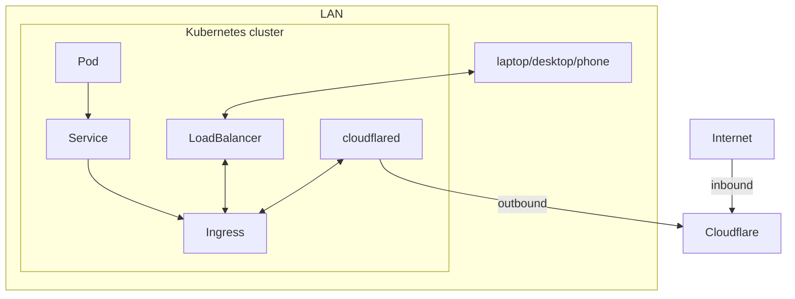

# Networking

As an example of how the networking works (because each system is different), this is an example of how you can
use cloudflared to setup a tunnel, that goes to and from the cluster.

TODO
