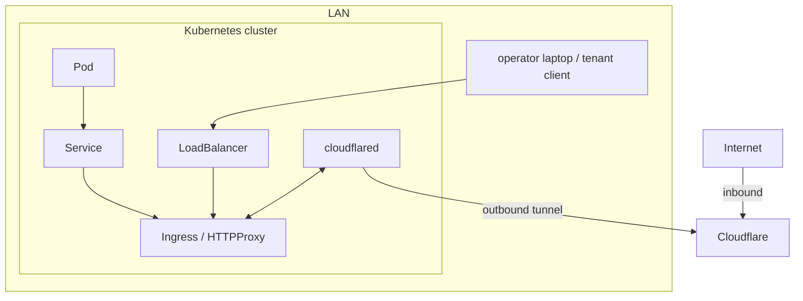

# Networking

Ubiquity treats networking as a layered Kubernetes contract rather than a single ingress diagram. Rendered objects describe intent; readiness evidence must come from controller status, live smoke tests, and policy behavior checks. Cilium is the preferred advanced CNI path when NetworkPolicy observability or Hubble flow inspection is required.


```mermaid
flowchart TD
  subgraph LAN
    client[operator laptop / tenant client] --> lb[LoadBalancer]
    subgraph k8s[Kubernetes cluster]
      pod[Pod] --> svc[Service]
      svc --> ing[Ingress / HTTPProxy]
      lb --> ing
      cf[cloudflared] <--> ing
    end
  end
  cf -- outbound tunnel --> cloudflare[Cloudflare]
  internet[Internet] -- inbound --> cloudflare
```

## Baseline policy model

The `system/network-policies` chart defaults to deny-first NetworkPolicy behavior:

- `default-deny-ingress` selects all pods and denies inbound traffic unless a more specific allow policy exists.
- `default-deny-egress` selects all pods and denies outbound traffic unless a more specific allow policy exists.
- `allow-dns` permits DNS egress so service discovery can continue while other egress is denied.
- Optional `default-allow-*` policies are disabled by default and must be explicitly enabled.

CI runs a dry-run contract for `test/e2e/network-policy-behavior.sh`. A live cluster can run the same script with `UBIQUITY_RUN_NETWORK_POLICY_E2E=true` to prove DNS is allowed and arbitrary HTTP traffic is blocked by default-deny policies.

## Tenant and AI networking

Tenant service networking uses Kubernetes Services, ingress resources, Gateway API resources, and service-specific operators. The control plane owns reconciliation and status; tenants consume only namespace-scoped Services, routes, and policies. Storage networking is isolated from tenant ingress paths: Longhorn, object storage, databases, and restore-drill traffic must be validated through their own service readiness markers rather than inferred from a working ingress route. AI/RDMA networking adds Multus `NetworkAttachmentDefinition` evidence and NVIDIA RDMA resources such as `nvidia.com/rdma` when the NVIDIA Network Operator path is enabled.

For NVIDIA AI workloads, readiness must show:

- network operator or Multus control-plane resources exist and report ready;
- `NetworkAttachmentDefinition` resources are present for RDMA-capable attachments;
- Kubernetes nodes expose positive `nvidia.com/rdma` allocatable capacity where RDMA is required;
- the `rdma-network-smoke-test-passed` marker exists after a real smoke test.

A rendered `NetworkAttachmentDefinition`, Service, Ingress, HTTPProxy, or TCPRoute is not proof of service readiness. It only proves intended configuration. Readiness evidence requires reconciled status conditions and smoke tests.

## Cloudflared boundary

`cloudflared` is an optional ingress tunnel pattern. It can expose cluster ingress through an outbound tunnel, but it does not replace Kubernetes readiness checks. A healthy tunnel is not proof that tenant services, NIM endpoints, object buckets, databases, or restore drills are ready.

## Geographic multi-cluster overlay

For geographically distributed AI platforms, Ubiquity uses NetBird as a private control/data overlay between independent Ubiquity clusters. NetBird is used for private GitOps control, administrator access, observability, and explicitly allowed private service paths. It is not a mechanism to stretch one Kubernetes cluster, CNI, RDMA fabric, NCCL collective, or storage system across regions.

Public inference traffic should enter each regional cluster through that region's local ingress/Gateway path and be selected by Geo DNS or a global load balancer. Public inference traffic must not hairpin through NetBird or through the management cluster. The full operating model, ApplicationSet label taxonomy, NetBird policy matrix, and per-region readiness gates are documented in [Multi-cluster NetBird overlay](multi-cluster-netbird.md).

## Validation commands

```sh
helm lint system/network-policies
helm template network-policies system/network-policies
test/e2e/network-policy-behavior.sh --dry-run
UBIQUITY_RUN_NETWORK_POLICY_E2E=true test/e2e/network-policy-behavior.sh
ubiquity cloud collect-readiness > /tmp/cloud-readiness-evidence.json
ubiquity cloud readiness --readiness-file /tmp/cloud-readiness-evidence.json
ubiquity health --ai
```

The readiness commands fail closed. Missing CRDs, absent controller conditions, missing network smoke markers, or object-only evidence must keep the platform not ready.
