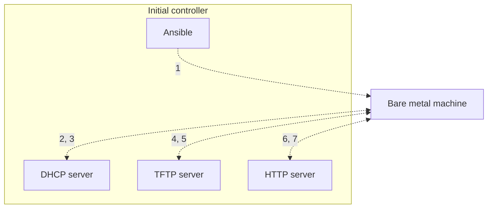

# Bare metal provisioning (PXE boot)

1. create-nodelist generates a nodelist, with expected IPs, settings, etc. 
2. node-data-generate.sh then creates the node data for the nodes and host including finding mac addresses `xx:xx:xx:xx:xx:xx`, into the output directory. This requires golang to be installed.
3. DHCP server: I hear you, here's your IP address, proceed to the next server to obtain your bootloader.
4. Machine: Hello, could you please send me my bootloader?
5. TFTP server: Here you go. Grab your boot configuration, kernel, and initial ramdisk as well.
6. Machine: Hi, I just booted into my bootloader, and my boot parameters instructed me to get the installation instructions, packages, etc. from this site.
7. HTTP server: It's all yours.
8. Machine: Great, now I can install the OS and reboot!

