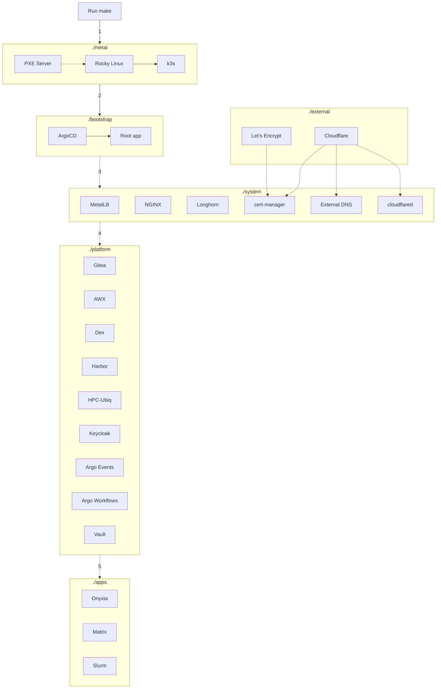

# Overview

## Components

```
+--------------+
|    ./apps    |
|--------------|
|  ./platform  |
|--------------|       +------------+
|   ./system   |- - - -| ./external |
|--------------|       +------------+
| ./bootstrap  |
|--------------|
|   ./metal    |
|--------------|
|   ./cloud    |
|--------------|
|   HARDWARE   |
+--------------+
```

### Main Components

- **`./metal`** - Bare metal management: install Linux, drivers, and Kubernetes
- **`./bootstrap`** - GitOps bootstrap with ArgoCD
- **`./system`** - Critical system components for the cluster (load balancer, storage, ingress, operation tools)
- **`./platform`** - Essential components for service hosting platform (Vault, Git, SSO)
- **`./cloud`** - Cloud platforms triggered at make time based on configuration to build on cloud provider
- **`./apps`** - User-facing applications
- **`./external`** (optional) - Externally managed services

### Support Components

- **`./tools`** - Tools container with all utilities needed to manage the cluster and troubleshoot issues, including disk image building
- **`./docs`** - All documentation that generates a searchable web UI
- **`./ubiq-playbooks`** - Bootstrapping Ansible playbooks for Ansible AWX (separate sub-repository at `https://github.com/ubiquitycluster/ubiq-playbooks`)
- **`./scripts`** - Scripts to automate common tasks such as configuring cluster deployment, retrieving passwords, etc.

## Provisioning Flow

Everything is automated. After you edit the configuration files, you just need to run a single `make` command and it will:

**Option 1: Build the `./cloud` layer:**
- Bootstrap OS and drivers via Terraform on chosen cloud provider
- Set up network policies to open a secure channel between cloud provider and bootstrap/on-premises environment  
- Build a Kubernetes cluster (based on k3s)

**Option 2: Build the `./metal` layer:**
- Download OS and drivers
- Create an ephemeral, stateless PXE server
- Install Linux on all servers in parallel
- Build a Kubernetes cluster (based on k3s)

**Step 3: Build the `./bootstrap` layer:**
- Install ArgoCD
- Configure the root app to manage other layers (and also manage itself)

**ArgoCD takes over and completes the deployment:**
- **Step 4:** Build the `./system` layer (storage, networking, monitoring, etc.)
- **Step 5:** Build the `./platform` layer (Gitea, Vault, SSO, etc.)
- **Step 6:** Build the `./apps` layer (Onyxia, Matrix, Slurm, etc.)

### Architecture Flow Diagram



## Detailed Provisioning Flow

Below is the pseudo code for the entire process. You don't have to read it right now, but it will be handy for debugging.

??? info "Detailed provisioning flow"

    ```text
    Human runs make:
        Option - build ./cloud:
            Start opus container
            Cloud build-out:
                Option - Azure:
                    Install azcli (will get folded into opus)
                    Do az login if first-time running to configure Azure credentials
                    Prompt via Ansible playbook for tenant and subscription IDs for project
                    Save in ./cloud/azure/terraform.tfvars
                    Run terraform init
                    Run terraform apply -auto-approve
                    Run az command to find tunnel information
                    Run Ansible playbook to setup tunnel
                Option - AWS:
                    Install awscli (will get folded into opus)
                    Prompt via Ansible playbook for subscriptions
                    Save in ./cloud/aws/terraform.tfvars
            Build a Kubernetes cluster:
                Download k3s binary
                Generate cluster token
                Copy k3s config files
                Enable k3s service and form a cluster
                Create KUBECONFIG file
                Create MetalLB config:
                    Use the last /27 subnet of the network
                    Apply the config

        Option - build ./metal:
            Start opus container
            Install the OS/drivers:
                Download the installer image and extract it
                Download any driver packages and extract them
                Create a PXE server on the controller using Docker Compose:
                    DHCP server
                    TFTP server
                    HTTP server
                Create init config for each machine (in the form of a kickstart file)
                Turn the machines on via WoL or IPMI (node-dependent)
                The machines boot:
                    Select network boot automatically
                    Broadcast DHCP request
                    DHCP server reply:
                        Machine IP
                        TFTP server (next-server) IP
                    Get boot files from TFTP server:
                        GRUB
                        GRUB config with URL to init config based on MAC address
                        Kernel
                        Initrd
                    Boot to the kernel
                    Download from HTTP server:
                        Init config from the URL in GRUB config
                        Remaining files required to boot
                    Install the OS based on the init config:
                        Configure the system
                        Remaining files required to install
                    Install drivers for OS based on the init config:
                        Configure drivers
                    Reboot to the new OS
                Controller sees the machines are ready
            Build a Kubernetes cluster:
                Download k3s binary
                Generate cluster token
                Copy k3s config files
                Enable k3s service and form a cluster
                Create KUBECONFIG file
                Create MetalLB config:
                    Use the last /27 subnet of the network
                    Apply the config

        Build ./bootstrap:
            Install ArgoCD:
                Apply Helm chart
                Wait for status
            Install root app:
                Select values file:
                    If Gitea unreachable (first install):
                        Get data from GitHub
                    Else:
                        Get data from Gitea
                Apply Helm chart
                Wait for status

    ArgoCD applies the rest:
        Clone git repo
        Install components based on directories:
            ./bootstrap (it manages itself):
                ArgoCD
                Root
            ./system:
                Storage
                Load balancer
                Ingress
                Etc.
            ./platform (depends on ./system):
                Git:
                    Migrate the Ubiquity repository from GitHub
                    ArgoCD switches the source from GitHub to Gitea
                CI
                Vault
                HPC-Ubiq
                Onyxia
                Etc.
            ./apps (depends on ./system and ./platform):
                Homepage
                Cloud shell
                Cloud CMD
                Etc.
    ```
