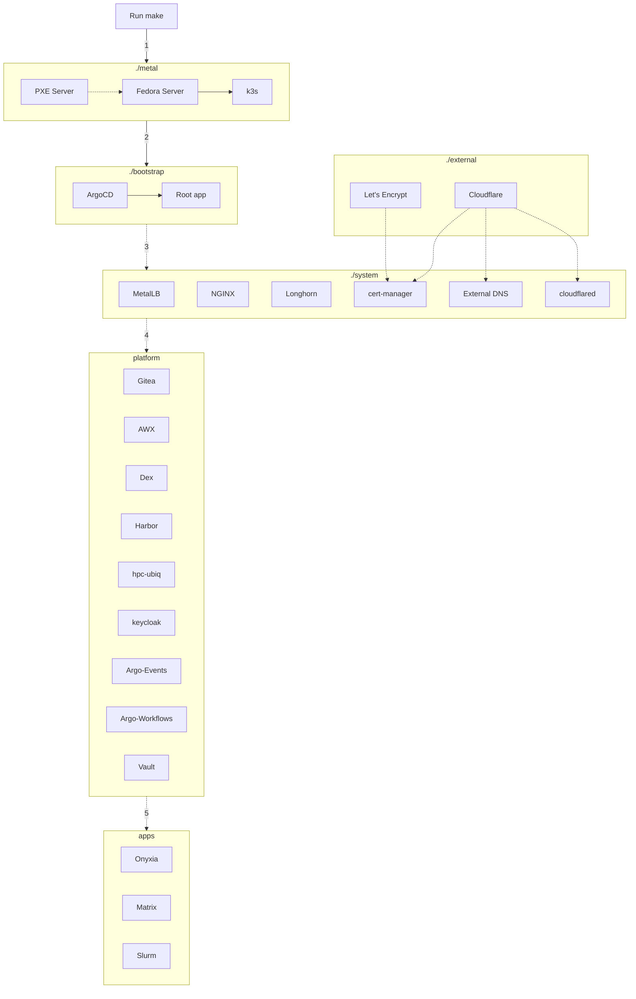

# Overview

## Components

```
+--------------+
|    ./apps    |
|--------------|
|  ./platform  |
|--------------|       +------------+
|   ./system   |- - - -| ./external |
|--------------|       +------------+
| ./bootstrap  |
|--------------|
|   ./metal    |
|--------------|
|   ./cloud    |
|--------------|
|   HARDWARE   |
+--------------+
```

Main components:

- `./metal`: bare metal management, install Linux, drivers and Kubernetes
- `./bootstrap`: GitOps bootstrap with ArgoCD
- `./system`: critical system components for the cluster (load balancer, storage, ingress, operation tools...)
- `./platform`: essential components for service hosting platform (vault, git...)
- `./cloud`: cloud platforms - triggered at make time based on configuration to build on cloud provider.
- `./apps`: user facing applications
- `./external` (optional): externally managed services

Support components:

- `./tools`: tools container, includes all the tools you'll need to manage the cluster and/or troubleshoot issues including disk image building.
- `./docs`: all documentation go here, this will generate a searchable web UI
- `./ubiq-playbooks` : bootstrapping ansible playbnooks for ansible AWX. A separate sub-repository hosted at `https://github.com/logicalisuki/ubiq-playbooks`.
- `./scripts`: scripts to automate common tasks such as configuring a cluster deployment, retrieving passwords, etc.

## Provisioning flow

Everything is automated, after you edit the configuration files, you just need to run a single `make` command and it will:

- (1 - Option) Build the `./cloud` layer:
    - Bootstrap OS and drivers via terraform on chosen cloud provider
    - Setup network policies to open a secure channel between cloud provider and bootstrap/on-prem environment
    - Build a Kubernetes cluster (based on k3s)
- (1 - Option) Build the `./metal` layer:
    - Download OS and drivers
    - Create an ephemeral, stateless PXE server
    - Install Linux on all servers in parallel
    - Build a Kubernetes cluster (based on k3s)
- (2) Build the `./bootstrap` layer:
    - Install ArgoCD
    - Configure the root app to manage other layers (and also manage itself)

From now on, ArgoCD will do the rest:

- (3) Build the `./system` layer (storage, networking, monitoring, etc)
- (4) Build the `./platform` layer (Gitea, Vault, SSO, etc)
- (5) Build the `./apps` layer: (Onyxia, Matrix, Slurm, etc)



Below is the pseudo code for the entire process, you don't have to read it right now, but it will be handy for debugging.

??? detailed "Detailed provisioning flow"

    ```
    Human run make:
        option - build ./cloud:
            start opus container
            cloud build-out:
                option - azure:
	            install azcli (will get folded into opus)
		    do az login if first-time running to configure azure credentials
            	    prompt via ansible playbook for tenant and subscription ids for project
		        save in ./cloud/azure/terraform.tfvars
                    run terraform init
                    run terraform apply -auto-approve
                    run az command to find tunnel information
                    run ansible playbook to setup tunnel
                option - aws
		    install awscli (will get folded into opus)
                    prompt via ansible playbook for subscriptions
                        save in ./cloud/aws/terraform.tfvars
            build a Kubernetes cluster:
                download k3s binary
                generate cluster token
                copy k3s config files
                enable k3s service and form a cluster
                create KUBECONFIG file
                create MetalLB config:
                    use the last /27 subnet of the network
                    apply the config
        option - build ./metal:
            start opus container
            install the OS/drivers:
                download the installer image and extract it
                download any driver packages and extract them
                create a PXE server on the controller using Docker Compose:
                    DHCP server
                    TFTP server
                    HTTP server
                create init config for each machine (in the form of a kickstart file)
                turn the machines on via WoL or IPMI (node-dependent)
                the machines boot:
                    select network boot automatically
                    broadcast DHCP request
                    DHCP server reply:
                        machine IP
                        TFTP server (next-server) IP
                    get boot files from TFTP server
                        GRUB
                        GRUB config with URL to init config based on MAC address
                        kernel
                        initrd
                    boot to the kernel
                    download from HTTP server:
                        init config from the URL in GRUB config
                        remaining files required to boot
                    install the OS based on the init config:
                        configure the system
                        remaining files required to install
                    install drivers for OS based on the init config:
                        configure drivers
                    reboot to the new OS
                controller see the machines are ready
            build a Kubernetes cluster:
                download k3s binary
                generate cluster token
                copy k3s config files
                enable k3s service and form a cluster
                create KUBECONFIG file
                create MetalLB config:
                    use the last /27 subnet of the network
                    apply the config
        build ./bootstrap:
            install ArgoCD:
                apply helm chart
                wait for status
            install root app:
                select values file:
                    if Gitea unreachable (first install):
                        get data from GitHub
                    else:
                        get data from Gitea
                apply helm chart
                wait for status
    ArgoCD apply the rest:
        clone git repo
        install components based on directories:
            ./bootstrap (it manages itself):
                argocd
                root
            ./system:
                storage
                loadbalancer
                ingress
                etc
            ./platform (depends on ./system):
                git:
                    migrate the ubiquity repository from GitHub
                    ArgoCD switch the source from GitHub to Gitea
                ci
                vault
                hpc-ubiq
                onyxia
                etc
            ./apps (depends on ./system and ./platform):
                homepage
                cloudshell
                cloudcmd
                etc
    ```
