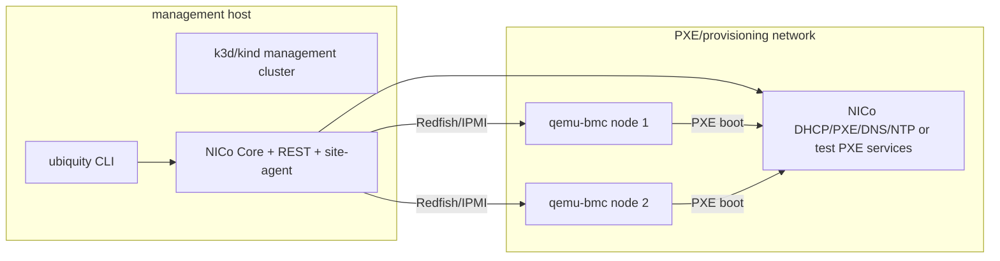

# KVM/QEMU PXE Validation Lab for NVIDIA Infra Controller

Yes: Ubiquity can validate most of the bare-metal lifecycle without physical servers by running "virtual physical nodes" as QEMU/KVM guests with emulated BMCs and PXE-capable NICs.

This lab is intentionally not a replacement for the gated bare-metal test. It is a pre-hardware integration tier that proves Ubiquity can drive the same control-plane surfaces used in production:

- BMC power and boot-device operations through Redfish or IPMI
- PXE/iPXE network boot from a provisioning network
- multi-OS boot image selection
- NICo Machine/Instance/Task lifecycle mapping
- Ubiquity live node status and safety-gate behavior

## Recommended emulator

The preferred emulator for this validation tier is `tjst-t/qemu-bmc`, described in:

<https://zenn.dev/tjst_t/articles/260223-qemu-bmc-server-simulation?locale=en>

`qemu-bmc` packages a QEMU VM and a BMC emulator in one OCI container. It exposes:

- Redfish API for service root, systems, managers, virtual media, chassis, reset, and boot override operations
- IPMI over LAN for chassis power and boot options
- noVNC console access
- optional in-band QEMU IPMI device support
- containerlab topology support

That is close enough to a physical node for Ubiquity/NICo preflight validation because NICo should see a machine with a BMC endpoint, a MAC address, a boot device that can be set to network, and a host that can PXE boot.

## What this can validate

| Capability | KVM/qemu-bmc lab | Physical hardware gate |
| --- | --- | --- |
| Redfish/IPMI authentication and power operations | yes | yes |
| Boot override to PXE/network | yes | yes |
| DHCP/PXE/iPXE flow | yes | yes |
| Rocky/RHEL/Ubuntu/custom image rendering | yes | yes |
| NICo Machine/Instance/Task client wiring | yes, if NICo can target the emulated BMC | yes |
| Ubiquity `nodes list/status/remove/reinstall/power/task` safety flow | yes, with virtual targets | yes |
| GPU Operator, MIG, RDMA, DCGM, real NIC/NVLink evidence | no | yes |
| BMC vendor quirks, firmware, NIC PXE ROMs, secure boot quirks | no | yes |

## Proposed topology



A useful first implementation should use one or two virtual nodes. Two nodes are enough to prove add/remove/reinstall/power/status logic and target disambiguation without needing a large virtual fleet.

## Host prerequisites

- Linux host or Linux VM with nested virtualization enabled
- Docker or Podman
- QEMU with KVM support, or QEMU TCG fallback for slower CI smoke tests
- containerlab if using the qemu-bmc containerlab topology
- `kubectl`, `helm`, and `go`
- bridge/TAP support on the host

macOS can run this through a Linux VM, but Docker Desktop alone is usually not enough for reliable nested KVM/TAP behavior.

## Ubiquity validation flow

1. Start the management cluster.

   ```bash
   go run ./cmd/ubiquity test --sandbox-deploy
   ```

2. Enable NICo for the root GitOps stack or install the NICo wrappers through `ubiquity up`.

   ```bash
   helm template root bootstrap/root --set nico.enabled=true
   go run ./cmd/ubiquity up --env prod --node-lifecycle-backend nico --dry-run
   ```

3. Start the virtual physical nodes.

   The implementation should use a generated containerlab topology or docker-compose file with one `qemu-bmc` container per virtual node.

4. Register virtual machines in Ubiquity/NICo inventory.

   Each virtual machine needs:

   - node name
   - site name
   - BMC address
   - BMC protocol: Redfish preferred, IPMI allowed
   - BMC username/password from an ignored local secret file
   - PXE MAC address
   - boot mode: BIOS or UEFI
   - OS image name

5. Create NICo Operating System objects for each bootable image type.

   Validate at least:

   - Rocky/RHEL kickstart-style image
   - Ubuntu autoinstall/cloud-init image
   - custom iPXE/user-data image

6. Run lifecycle tests.

   ```bash
   UBIQUITY_NICO_MODE=live \
   UBIQUITY_NICO_BASE_URL=https://nico-rest.example.invalid \
   go run ./cmd/ubiquity nodes list --site kvm-lab

   go run ./cmd/ubiquity nodes os apply rocky-9 --site kvm-lab
   go run ./cmd/ubiquity nodes add qemu-node-01 --os-image rocky-9 --site kvm-lab
   go run ./cmd/ubiquity nodes status qemu-node-01 --site kvm-lab
   go run ./cmd/ubiquity nodes reinstall qemu-node-01 --os-image ubuntu-24.04 --confirm qemu-node-01 --site kvm-lab
   go run ./cmd/ubiquity nodes power qemu-node-01 reset --confirm qemu-node-01 --site kvm-lab
   go run ./cmd/ubiquity nodes remove qemu-node-01 --confirm qemu-node-01 --site kvm-lab
   ```

7. Assert state transitions.

   Required assertions:

   - Redfish/IPMI power command reaches the emulated BMC
   - boot override changes to network/PXE for install/reinstall
   - VM requests DHCP/PXE from the provisioning network
   - NICo task enters a terminal success/failure state
   - `ubiquity nodes status` reflects NICo state plus any Kubernetes evidence available
   - destructive operations require exact `--confirm`

## Implementation shape in this repository

Add a dedicated opt-in test tier rather than blending this into the default sandbox test:

- `test/e2e/nico-kvm-pxe-lab.sh`
  - checks prerequisites
  - refuses to run unless `UBIQUITY_NICO_KVM_LAB=1`
  - starts the qemu-bmc/containerlab topology
  - waits for Redfish/IPMI readiness
  - invokes Ubiquity node lifecycle commands
  - tears down the topology

- `test/fixtures/nico-kvm-pxe/containerlab.yml`
  - one or two qemu-bmc virtual nodes
  - deterministic management/BMC addresses
  - deterministic PXE MAC addresses

- `test/fixtures/nico-kvm-pxe/inventory.yaml`
  - Ubiquity NodeInventory for the virtual nodes
  - no real secrets
  - references ignored local secret files or environment variables

- `docs/reference/nvidia-infra-controller/kvm-pxe-validation-lab.md`
  - this document

## Security rules

- Never commit BMC credentials, NICo tokens, generated kubeconfigs, TLS keys, or connection strings.
- Use environment variables or ignored local files for qemu-bmc/NICo credentials.
- Any sample secret value must be `[REDACTED]` or a clearly fake local-only value.

## Limitations

This lab cannot prove physical GPU/RDMA readiness. It should be used to catch lifecycle integration errors before hardware time is consumed. Final production acceptance still requires the physical hardware gate: the gated bare-metal E2E path with real NVIDIA GPU/RDMA nodes.
