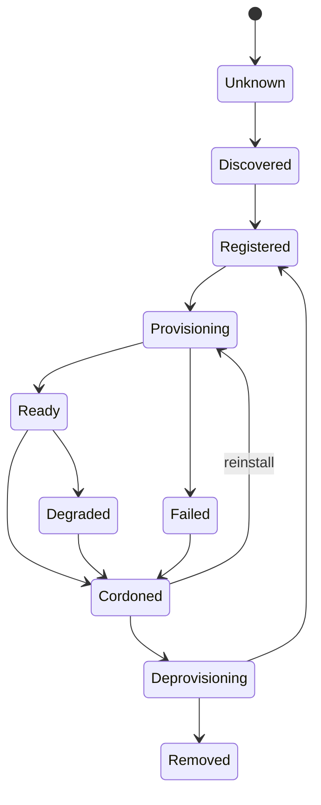

# NVIDIA Infra Controller node state machine

Status: experimental/preview. This reference gives Ubiquity operators a common vocabulary for NICo Machine, Instance, and Task states. It is descriptive guidance for Ubiquity documentation and scripts, not a normative upstream API contract and not a certification statement.

## Objects

- Machine: physical server inventory and lifecycle target.
- Operating System: image and install intent assigned to a Machine.
- Instance: realized runtime created from a Machine and Operating System assignment.
- Task: auditable lifecycle operation that moves a Machine or Instance toward a desired state.
- Machine GPU stats: accelerator inventory and health/status evidence associated with a Machine.

## Machine states

Use these Ubiquity-facing state names in runbooks even if the deployed NICo API returns implementation-specific condition names:

| State | Meaning | Typical next action |
| --- | --- | --- |
| `Unknown` | Machine exists in a record but current status is unavailable. | Check site-agent, API, and network reachability. |
| `Discovered` | Hardware was discovered but not yet approved for lifecycle control. | Review inventory and BMC mapping. |
| `Registered` | Machine is approved and has required identifiers. | Assign Operating System or reserve. |
| `Provisioning` | An install or reinstall Task is running. | Watch Task logs and BMC console. |
| `Ready` | Machine is provisioned and available for use. | Admit workloads or continue validation. |
| `Degraded` | Machine is reachable but has health or inventory issues. | Triage hardware, OS, GPU, or network state. |
| `Cordoned` | Machine is intentionally unavailable for new work. | Reinstall, deprovision, or maintenance. |
| `Deprovisioning` | NICo is removing runtime state or returning the server to pool. | Watch Task completion. |
| `Removed` | Machine is no longer managed by NICo. | Confirm inventory deletion and ownership transfer. |
| `Failed` | A Task or reconciliation reached an error terminal state. | Preserve evidence and follow runbook. |

## Task states

| State | Meaning |
| --- | --- |
| `Pending` | Task accepted but not yet running. |
| `Running` | Task is actively reconciling. |
| `WaitingForMachine` | Task is blocked on power, boot, network, or inventory. |
| `WaitingForOS` | Task is blocked on image retrieval, checksum, or install media. |
| `WaitingForInstance` | Task is waiting for OS boot, kubelet join, or runtime checks. |
| `Succeeded` | Task completed its requested operation. |
| `Failed` | Task reached an error terminal state. |
| `Cancelled` | Operator or controller stopped the Task before success. |

## Instance states

| State | Meaning |
| --- | --- |
| `Absent` | No realized runtime exists for the Machine. |
| `Installing` | OS installation or first boot is in progress. |
| `Booting` | Installed OS is booting and joining expected services. |
| `Ready` | Runtime is healthy enough for the intended pool. |
| `Degraded` | Runtime exists but health checks are incomplete or failing. |
| `Deleting` | Runtime is being removed. |

## State transition guidance

## Operator rules

- Do not start a destructive Task from `Unknown`; restore observability first.
- Do not reinstall directly from `Ready` without cordon/drain where the Machine is a Kubernetes node.
- Do not delete inventory for a Machine with an active Task.
- Preserve Task IDs and failure messages before retrying.
- Record breakglass operations if BMC or console actions occur outside NICo.
